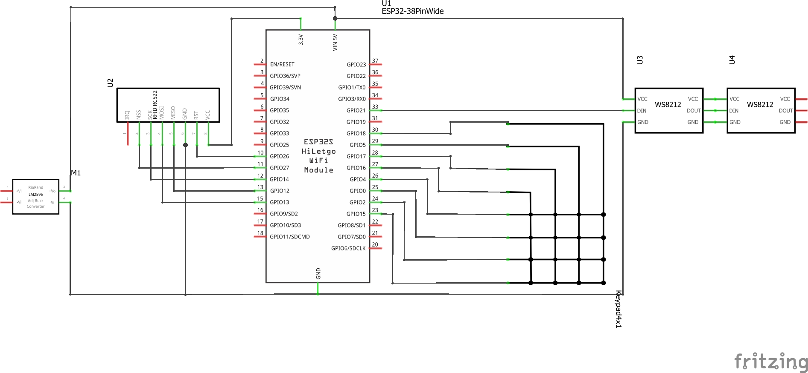

# NFC (Door) access control system
This project is an access control system, that allows you to grant access via NFC and / or Google Authenticator codes.

The idea was born as my growing kids had problems to fully turn the key to open the latch. That easy :)

<br>*This project just handles the authentication and calls an URL after authentication succeeds*<br><br>

Thus on one side you can use this as a generic hardware authentication system, but on the other side you will need an infrastructure (any electronic device) that will actually open the door / disarm an alarm-system for you.
<br><br>
I use standard (vulnerable but silly cheap) Mifare 1K chips, a NFC522 reader, ESP32, WS2812 LED's and a keypad.

The reason I chose Mifare 1K chips was to attempt to use logic and a threat model to secure the insecure nature of these chips as much as possible. Still, there are flaws but for homes it gives me a good feeling, sure you don't want this to secure a high level target like a rocket start base :)

<br>

# Authentication features
Currently I have implemented the following authentication features:
   * NFC Authentication only (tap and go)
   * GAuth Authentication with PIN
   * NFC + Google Authenticator with PIN
   * NFC + Google Authenticator without PIN
   * NFC + PIN

You can configure each user seperatly and mix together the authentication options.<br>
For example:
   * User1 can use NFC-only authentication
   * User2 can use NFC + GAuth with PIN 
   * User3 can use GAuth only
   * User3 can use NFC + PIN

Everything is configureable in a text based json config file.

If you just want NFC authentication you can let the keypad unconnected.

# Security
The most energy to secure the thing has been put to the most vulnerable part of this system: the Mifare Classic Tags. As we cannot change the design issues with Mifare Classic in general, the only attempt to get better security is to put a logical security layer in-between.

This logical layer of additional security is based off of a threat model I created for this application:
   * UID of tags can be cloned
   * Sector R/W encryption on those tags can be cracked in less than 10 minutes
   * Emulators exist and are used a lot (e.g. proxmark)
   * Hardware can be ripped away, thus the code and stored keys can be extracted
      * As a result of the above your WiFi can be hacked as the password is stored on the device

**This results to the implemtation of these following defenses:**
  * UID of tags can be cloned
     * _Chinese Changeable UID detection via NFC commands with customizable action at server side (e.g. notify via telegram or mail) and rejection_
  * Sector R/W encryption on those tags can be cracked in less than 10 minutes
     * _new random key generation with every usage of the tag, key is encrypted and saved on the tag, verified with each new tapping attempt_
     * _each tag get randomly generated read/write keys that are distinct for that tag_
     * _for each new tag the position of the key within the tag memory is randomly chosen_
     * _each block of each sector is filled with randomly generated data. This obfuscates the location of the real key and if one don't compare the same tag multiple times, you cannot distingush the position of the key_
  * Emulators exist and are used a lot (e.g. proxmark)
     * _old key is read, new key generated and written to the card, then read again_ (most emu's don't store the new values directly)
  * Hardware can be ripped away, thus the code and stored keys can be extracted
     * _the whole key generation and verification is done at the server, not the reader. The hardware "outside" is only for interacting with the tag based on the responses from the server_
     * _however I have an extra firewalled "IoT" DMZ WiFi that can only communicate with the Webserver - this helps if someone gets knowledge of the WiFi SSID and Password_
<br><br>

**However, there is still some flaws so these mitigations are not enough to meet my sense of security:**
   * There are (rare) one-time UID changeable tags which don't react to the "magic" commands after written one-time, so our reader would accept them
   * There is a race-condition: if someone cracked all sectors and wrote them to a one-time writeable tag, if he would immediantly go to the reader he would be able to gain access. 
      * but you would notice it as your tag won't work anymore
      * if you would be faster his tag won't work anymore (because the key changed in the meantime)
   * If two people with modified android phones and cellular connection would stand in front of the tag and in front of your reader, they would be able to forward the communication between the tag and your reader (same technique as tesla's got hacked)

<br>
This is why 2FA (NFC+GAuth) and 3FA (NFC+PIN+GAuth) has been implemented additionally.<br>
Thx to ramm84 for the GAuth idea.

In "maximum" security mode you have is 3 factors (configurable per user in any combination):
   * one thing you have (the Tag)
   * one thing you know (the PIN)
   * one thing that is not static (GAuth)

<br><br>

# Installation
## Wiring



# Configuration
## Setup ESP32 Files
   * boot.py
      * Change the Hostname it should get from DHCP:
        > wlan.config(dhcp_hostname="NFC_DoorControl")
      * Change the values for your WiFi accordingly / to connect to a specific accesspoint:
        > wlan.connect('WiFi_Name', 'WiFi Password')

        > wlan.connect('WiFi_Name', 'WiFi Password', bssid=b'\xab\xcd\xef\xab\xcd\xef')
   * main.py
     * Config is in the upper part of the file
     * authurl: define the URL where your PHP Files are located:
       > authurl = 'http://your-server/rfid-auth/auth.php'
     * device_id: identifies your device within the server configuration
       > device_id = 'frontdoor'
     * nfc_writemessage: message that is written to every tap in sector 0 and readable by everyone (17 chars! be creative )
       > nfc_writemessage = b"Fsck off         "

## Setup PHP Files
   * configuration.php
      * You should at least change the hmac key for generating the hash for the random number and the following functions to control the door:
        > function door_open($device_id,$uid)

        > function door_close($device_id,$uid)

        > function door_toggle($device_id,$uid)

        > function china_uid_detected($device_id,$uid,$name)

        > function unknown_uid_detected($device_id,$uid)   

### RFID Userdatabase (rfid.txt)
| option | required | possible values | description |
| ------ | -------- | --------------- | ----------- |
| key_name | yes | string | defines a readable name to the tag, just for reference |
| device_ids | no | json_array | if undefined, all device_id access is allowed, if defined it allows only specific doors. If "all" is set in the array, same as not defined: allow access on all devices |
| reset | no  | 1 | if set for a user the RFID tag keys will be reset, the content will be cleared. Tag is now "prestine" again. |
| gauth_secret | no | string | if set, user is requested for a Google Authenticator code after NFC verified successfully |
| gauth_pin | no | 4-char string | if set, user is requested for a Google Authenticator code + PIN after NFC verified successfully, **depends on a configured gauth_secret** |
| nfc_pin | no | 4-char string | if set, user is requested for a PIN after NFC verified successfully, **mutually exclusive to gauth_*** (use this **or** gauth_*) |

### RFID Userdatabase examples:
Minimum tag configuration:
```
    "0a0b0c0d": {
      "key_name": "Yellow Tag User 1"
    },
```
Specific access allowed on defined device_ids:
```
    "0a0b0c0d": {
      "key_name": "Yellow Tag User 1",
      "device_ids": [
         "frontdoor",
         "backdoor"
      ],
    },
```

Delete a tag and reset all content:
```
    "0a0b0c0d": {
        "key_name": "Yellow Tag User 1",
        "reset":1
    },
```

NFC + Google Authenticator with PIN setup:
```
    "0a0b0c0d": {
        "key_name": "Yellow Tag User 1",
        "gauth_secret": "TXKCLJRXB4OIFCHZ",
        "gauth_pin": "6666",
    },
```

NFC + PIN Setup:
```
    "0a0b0c0d": {
        "key_name": "Yellow Tag User 1",
        "nfc_pin": "6666",
    },
```
### GAuth only Userdatabase (googleauth.txt)
For this, you have only the option to define the PIN (must be 4 chars!) and the Secret that is used to generate the Google Authenticator codes.

### GAuth only examples:
Static PIN of 1234 with GAuth secret:
```
    "1234": {
        "key_name": "GAuth User 1",
        "GAuthSecret": "TXKCLJRXB4OIFCHZ"
    },
```
### Generating a Google Auth Code
I didn't implement QR Code generation, but you can use http://your-server/rfid-auth/auth.php?QR=1 to generate a Code that can be put in the rfid.txt configuration file and manually put in your phone.

## Software installation
   * Installing micropython on ESP32
      * See [Installing Micropython on ESP32](https://docs.micropython.org/en/latest/esp32/tutorial/intro.html)

   * Copy the files to ESP32
      ```
      > rshell --buffer-size 32 -p COM7
         Using buffer-size of 32
         Connecting to COM7 (buffer-size 32)...
         Trying to connect to REPL .... connected
         Testing if ubinascii.unhexlify exists ... Y
      > cp boot.py /boot.py
      > cp main.py /main.py
      > cp keypad_timer.py /keypad_timer.py
      > cp mfrc522.py /mfrc522.py      
      ```
   * Copy and adjust the PHP files from the "PHP" folder to your webserver      
   * Test :)


# Get Involved!
If you want, you're welcome to change, modify, use and adjust this project as you need to.

Please try to manipulate, hack and circumvent this system, fix the problems you found and send me a pull request, I would really appreciate it!

**The only way we can get better is together.**

Fell free to DM or @mention me on twitter!

[](https://twitter.com/devBioS)  

<br><br>

# ShoutOut
Greetings to my family who badly needed such a system, to the whole DEFCON community, my colleagues, the people at DCZIA especially @syntax976 and @LunaSylumDancer for postponing my release date because they thought they should do a badge challenge (that was great! thx!) :)